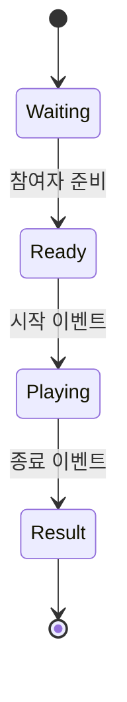
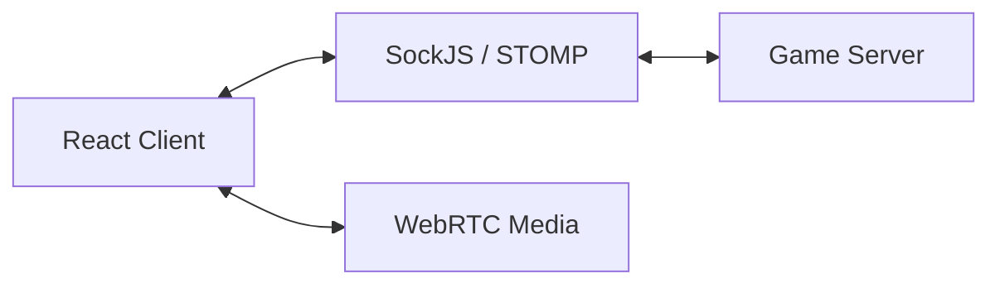

# 🕵️ Suspect X

영상과 실시간 채팅으로 소통하며 제한 시간 안에 사건을 추리하는 멀티플레이 웹 서비스입니다.

> 이 저장소는 프로젝트 경험과 기여를 정리한 소개 저장소이며 소스 코드는 포함하지 않습니다.

## 프로젝트 정보

- **기간**: 2026.01 ~ 2026.02
- **형태**: Team Project
- **역할**: Frontend Developer

## 문제와 목표

멀티플레이 추리 게임에서는 단순히 화상 통화를 제공하는 것만으로는 충분하지 않습니다. 참여자의 입장·준비 상태, 게임 시작 시점, 제한 시간과 진행 단계가 모든 화면에서 동일하게 유지돼야 합니다. 서버에서 전달되는 실시간 이벤트를 화면 상태와 안정적으로 연결하는 것을 핵심 목표로 삼았습니다.

## 주요 기능

- 게임방 입장과 대기실
- 참여자 준비 상태와 게임 시작
- 실시간 영상·채팅
- 게임 단계별 화면 전환
- 제한 시간 타이머와 진행 상태 표시

## 담당 업무

- React 기반 대기실과 게임 진행 화면 구현
- SockJS·STOMP 구독 이벤트를 클라이언트 상태와 연결
- 참여자 입장·퇴장·준비·시작 이벤트에 따른 UI 갱신
- 게임 단계에 맞춘 타이머, 채팅, 영상 영역 제어

## 실시간 상태 흐름

서버가 전달하는 이벤트와 사용자의 화면 조작을 같은 상태 변경으로 처리하면 이벤트 순서에 따라 화면이 어긋날 수 있습니다. 서버가 확정한 방 상태를 기준으로 화면을 전환하고, 로컬 UI 상태는 입력과 표시 책임에 집중하도록 구분했습니다.

## Tech Stack

- **Frontend**: React, Vite, JavaScript
- **Realtime**: SockJS, STOMP
- **Media**: WebRTC
- **Collaboration**: Git, GitLab, Jira

## 배운 점

- 실시간 서비스에서는 화면을 먼저 바꾸기보다 서버 이벤트를 기준으로 상태 전이를 설계해야 한다는 점
- 연결·재연결과 참여자 변동 같은 예외 상황을 정상 흐름과 함께 고려해야 한다는 점
- 여러 실시간 기능이 동시에 동작할 때 기능별 상태와 게임 전체 상태의 책임을 분리해야 한다는 점
